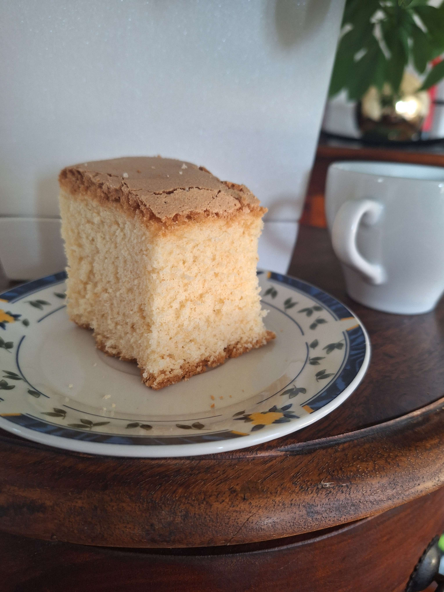

Babka Majonezowa
======================

Składniki
--------------------
- 5 jajek
- :math:`\frac{3}{4}` szklanki mąki pszennej
- :math:`\frac{1}{2}` szklanki mąki ziemniaczanej (skrobia ziemniaczane)
- 1 :math:`\frac{1}{2}` łyżeczki proszku do pieczenia
- 1 szklanka cukru
- 4 kopate łyżki majonezu winiary

Sposób przygotowania
------------------------------
Białka ubić z cukrem bardzo dokładnie. Do ubitych białem dodajemy żółtka zmniejszając przy tym obroty miksera. Następnie dodajemy pozostałem skłądniki na przemian i miksujemy wszystko na minimalnych obrotach miksera. Gotową masę piec w :math:`160-165^\circ` przez ok. 30-35 minut  

..    :width: 400px